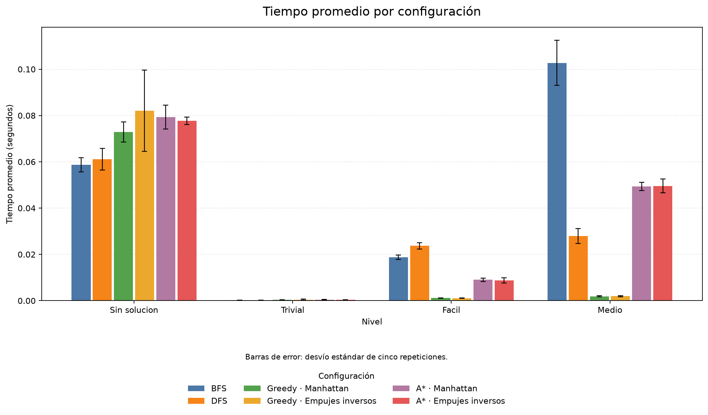
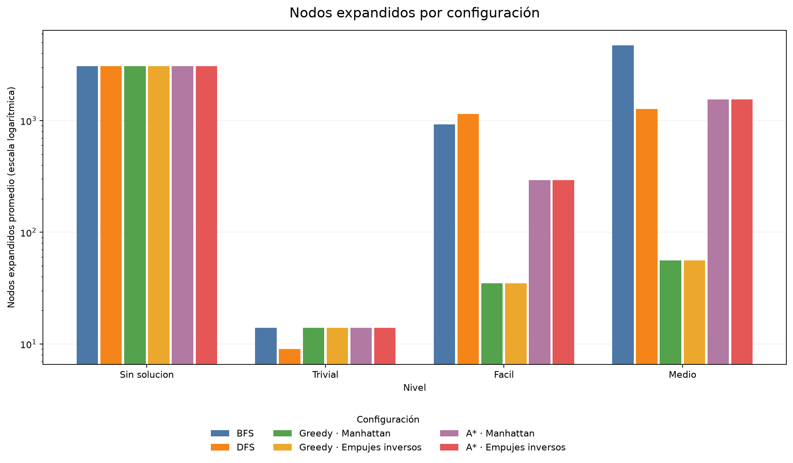
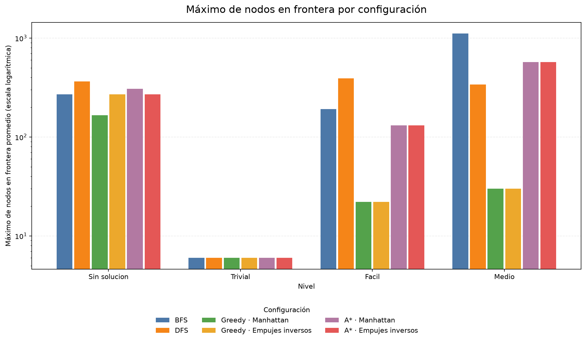
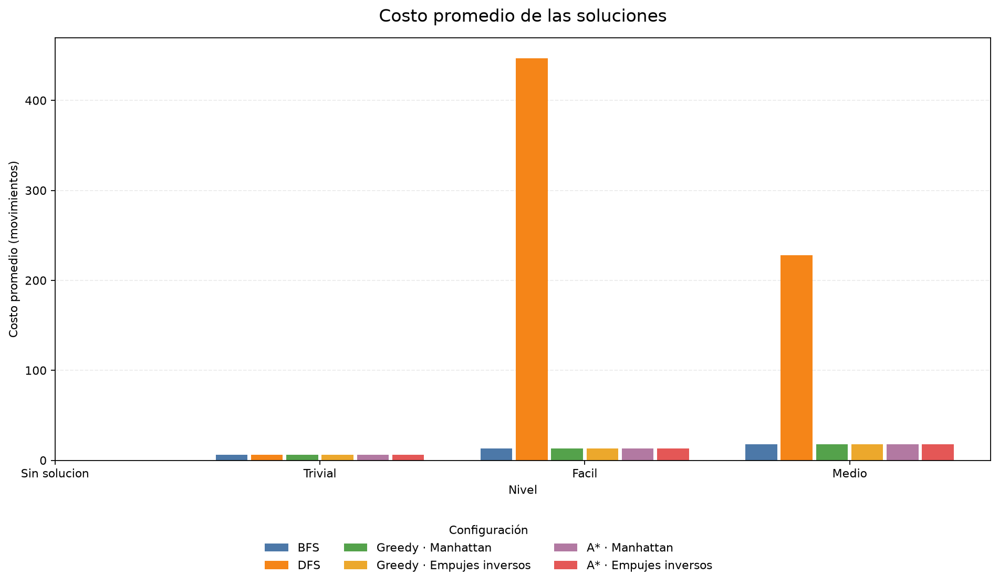

# TP1 — Métodos de búsqueda para Sokoban

Implementación del ejercicio de Sokoban del TP1 de Sistemas de Inteligencia
Artificial. El proyecto modela el problema con estados inmutables, resuelve
niveles mediante cuatro métodos de búsqueda y produce experimentos y gráficos
reproducibles desde una única interfaz en español.

Cada acción mueve al jugador una celda y tiene costo 1, con o sin empuje. Por lo
tanto, el costo de una solución es su cantidad de movimientos.

## Requisitos e instalación

- Python 3.11 o posterior.
- Matplotlib únicamente para generar las figuras.
- Pillow únicamente para animar soluciones, y ffmpeg en el PATH sólo para el
  formato de video.

Desde esta carpeta:

```powershell
python -m venv .venv
.\.venv\Scripts\Activate.ps1
python -m pip install -e ".[dev,analysis,visual]"
```

El motor y los experimentos usan la biblioteca estándar. El extra `dev` agrega
pytest, `analysis` agrega Matplotlib y `visual` agrega Pillow.

## Uso de la CLI

La ayuda general muestra los tres subcomandos:

```powershell
python -m sokoban --help
```

### Resolver un nivel

```powershell
python -m sokoban resolver --nivel niveles/nivel_02_facil.txt
python -m sokoban resolver --nivel niveles/nivel_03_medio.txt --algoritmo bfs
python -m sokoban resolver --nivel niveles/nivel_03_medio.txt `
  --algoritmo astar --heuristica manhattan --max-expandidos 100000
python -m sokoban resolver --nivel niveles/nivel_01_trivial.txt --mostrar-estados
```

Opciones relevantes:

| Opción | Descripción |
|---|---|
| `--nivel RUTA` | Archivo XSB que se debe resolver. |
| `--algoritmo {bfs,dfs,greedy,astar}` | Método; por defecto, `astar`. |
| `--heuristica {manhattan,empujes_inversos}` | Sólo Greedy y A*. Por defecto, `empujes_inversos`. |
| `--max-expandidos N` | Límite positivo y exacto de expansiones. |
| `--mostrar-estados` | Reproduce la solución como tableros ASCII. |

BFS y DFS rechazan una heurística porque son métodos desinformados. La salida
incluye estado, algoritmo, heurística, costo, movimientos, nodos expandidos,
frontera final, máximo histórico de frontera, tiempo y motivo de terminación.
Los códigos de salida son 0 para éxito, 1 para fracaso o corte y 2 para errores
de uso, nivel o configuración.

### Ejecutar los experimentos

```powershell
python -m sokoban experimentar --configuracion configuracion.json
```

El comando valida toda la configuración, resuelve sus rutas desde la ubicación
del JSON y prepara los cuatro niveles antes de iniciar cualquier cronómetro.
Después crea las 120 corridas configuradas, baraja solamente su orden con una
instancia local de `random.Random(semilla)` y ejecuta cinco repeticiones por
combinación.

Genera:

- `resultados/ejecuciones.csv`: una fila por corrida, con todas las métricas.
- `resultados/resumen.csv`: agregación por nivel, algoritmo y heurística.

En el resumen, la tasa de éxito usa las cinco repeticiones; el costo promedio
usa sólo las exitosas; los promedios de nodos, frontera y tiempo usan todos los
intentos; y los fracasos y cortes se cuentan por separado. Cada corrida crea
bookkeeping y cachés heurísticas nuevas, aunque reutiliza el preprocesamiento
inmutable del nivel.

### Generar las figuras

```powershell
python -m sokoban graficar --configuracion configuracion.json
```

El comando lee `resultados/resumen.csv` y genera únicamente:

- `resultados/figuras/tiempo_promedio.png`, con desvío estándar.
- `resultados/figuras/nodos_expandidos.png`.
- `resultados/figuras/max_nodos_frontera.png`.
- `resultados/figuras/costo_solucion.png`.

Las métricas de nodos usan escala logarítmica cuando la razón entre el máximo y
el mínimo positivo es al menos 100. La decisión depende sólo de los datos, por
lo que es reproducible.

#### Graficar un subconjunto

Las cuatro figuras se pueden restringir a ciertos niveles, algoritmos o
heurísticas, que es lo útil para aislar una comparación en la presentación:

```powershell
python -m sokoban graficar --algoritmos bfs dfs
python -m sokoban graficar --algoritmos astar --heuristicas manhattan empujes_inversos
python -m sokoban graficar --niveles facil medio --algoritmos bfs astar
python -m sokoban graficar --algoritmos greedy --salida-figuras resultados/figuras/greedy
```

| Opción | Descripción |
|---|---|
| `--niveles NOMBRE ...` | Niveles por su `nombre` en la configuración. |
| `--algoritmos ALGORITMO ...` | Subconjunto de los algoritmos configurados. |
| `--heuristicas HEURISTICA ...` | Subconjunto de las heurísticas configuradas; sólo afecta a Greedy y A*. |
| `--salida-figuras RUTA` | Carpeta de destino de las cuatro figuras. |

Cada selección debe estar declarada en la configuración; si no, el comando
termina con código 2 y lista las opciones disponibles. Las figuras respetan el
orden de la configuración y no el de la línea de comandos, así que el mismo
subconjunto produce siempre las mismas imágenes.

Una corrida filtrada no describe la configuración completa, por lo que sus
figuras van a `resultados/figuras/filtradas/` en lugar de pisar las del informe.
Con `--salida-figuras` se elige otra carpeta, y sin filtros se sobrescriben las
figuras oficiales como antes.

### Animar una solución

```powershell
python -m sokoban animar --nivel niveles/nivel_03_medio.txt
python -m sokoban animar --nivel niveles/nivel_02_facil.txt --algoritmo bfs --escala 56
python -m sokoban animar --nivel niveles/nivel_06_original.txt --algoritmo dfs `
  --max-expandidos 2000000 --formato mp4
python -m sokoban animar --nivel niveles/nivel_01_trivial.txt `
  --frames resultados/animaciones/frames
```

Resuelve el nivel, imprime las mismas métricas que `resolver` y dibuja un frame
por movimiento. Sin `--salida`, el archivo va a
`resultados/animaciones/<nivel>_<algoritmo>.<formato>`.

| Opción | Descripción |
|---|---|
| `--salida RUTA` | Archivo de destino; la extensión define el formato. |
| `--formato {gif,mp4}` | Formato cuando no se da `--salida`. |
| `--fps N` | Cuadros por segundo del video. |
| `--ms N` | Milisegundos por paso del GIF. |
| `--escala N` | Lado de cada celda en píxeles. |
| `--submuestreo N` | Dibuja uno de cada N pasos. |
| `--max-frames N` | Tope de frames; `0` lo desactiva. |
| `--sin-encabezado` | Sólo el tablero, sin título ni barra de progreso. |
| `--frames CARPETA` | Además guarda un PNG por frame. |

#### Soluciones largas

DFS devuelve caminos de miles de movimientos, y ahí los dos formatos se
comportan distinto:

- El **GIF** se topea en 400 frames y dibuja uno de cada N pasos, porque cada
  frame queda guardado dentro del archivo. Sirve para ver la forma de la
  solución, no cada movimiento.
- El **video** no tiene tope: los frames se generan de a uno y se mandan a
  ffmpeg por streaming, así que la memoria no depende del largo del camino. Es
  la salida para mostrar una solución completa sin saltos.

Los caminos de 600 pasos o más pasan a 60 cuadros por segundo en lugar de 12,
para que la animación dure algo razonable. Antes de renderizar, el comando
informa cuántos frames son y cuánto va a durar el video.

Como referencia, la solución de DFS para `nivel_06_original` son 7 103
movimientos: 7 104 frames a 60 fps, 1:58 minutos de video y 2,6 MB, en unos 26
segundos de renderizado.

## Formato y niveles

El parser acepta los símbolos XSB siguientes y conserva filas desiguales y
espacios significativos:

| Símbolo | Significado |
|---|---|
| `#` | Pared. |
| espacio | Piso. |
| `.` | Objetivo. |
| `@` | Jugador. |
| `$` | Caja. |
| `+` | Jugador sobre objetivo. |
| `*` | Caja sobre objetivo. |

Se exige exactamente un jugador, al menos una caja y un objetivo, y la misma
cantidad de cajas y objetivos. Una coordenada ausente de una fila no se infiere
como piso.

La configuración reproducible usa cuatro niveles representativos:

| Nombre | Archivo | Propósito |
|---|---|---|
| `sin_solucion` | `nivel_00_sin_solucion.txt` | Verificar el fracaso al agotar estados. |
| `trivial` | `nivel_01_trivial.txt` | Prueba pequeña de punta a punta. |
| `facil` | `nivel_02_facil.txt` | Comparar métodos con dos cajas. |
| `medio` | `nivel_03_medio.txt` | Exponer diferencias de costo y expansiones. |

Los niveles 04 a 06 permanecen como casos adicionales, pero no forman parte de
la corrida reproducible del informe.

## Diseño

La parte estática y la dinámica están separadas:

- `Mapa` guarda pisos explícitos, paredes y objetivos.
- `Estado` guarda jugador y cajas en una estructura inmutable y hasheable.
- `ProblemaSokoban` concentra movimientos, sucesores y orden de acciones.
- Las tablas de empujes inversos se calculan una vez por nivel.
- Los empujes a celdas muertas o bloques 2×2 congelados se podan de manera
  conservadora.

Los algoritmos siguen estas reglas:

| Método | Prioridad | Garantía en este modelo |
|---|---|---|
| BFS | Profundidad creciente mediante FIFO. | Óptimo. |
| DFS | Profundidad mediante LIFO y orden `U,D,L,R`. | No garantiza optimalidad. |
| Greedy | Menor `h`, con desempate estable. | No garantiza optimalidad. |
| A* | Menor `g+h`, reapertura y descarte de entradas obsoletas. | Óptimo con las heurísticas incluidas. |

Las dos heurísticas resuelven una asignación uno a uno entre cajas y objetivos:

- `manhattan`: usa distancias Manhattan.
- `empujes_inversos`: usa distancias de empuje que respetan paredes y devuelve
  infinito cuando no existe una asignación completa.

Los nodos objetivo se comprueban antes de expandirse. `nodos_frontera` es la
cantidad de entradas restantes al terminar y `max_nodos_frontera` es el máximo
histórico desde la frontera inicial.

## Resultados reproducibles

Los costos y nodos siguientes provienen de `resultados/resumen.csv`; cada celda
resume cinco ejecuciones. Las dos heurísticas produjeron los mismos costos y
nodos expandidos en los niveles resolubles, por eso se muestra una sola columna
por método informado.

| Nivel | BFS: costo / expandidos | DFS: costo / expandidos | Greedy: costo / expandidos | A*: costo / expandidos |
|---|---:|---:|---:|---:|
| Trivial | 6 / 14 | 6 / 9 | 6 / 14 | 6 / 14 |
| Fácil | 13 / 927 | 447 / 1147 | 13 / 35 | 13 / 292 |
| Medio | 18 / 4703 | 228 / 1274 | 18 / 56 | 18 / 1552 |

BFS y A* coinciden en los costos óptimos. Greedy también encuentra esos costos
en esta selección, aunque el algoritmo no ofrece esa garantía. DFS evidencia
su sensibilidad al orden: devuelve caminos mucho más largos en Fácil y Medio.
Greedy expande menos nodos, mientras que A* conserva la garantía de optimalidad.

### Estado de fracasos y cortes

Sólo se muestran configuraciones con al menos un intento no exitoso. La corrida
de referencia no alcanzó el límite de 100 000 expansiones en ningún caso.

| Nivel | Algoritmo | Heurística | Éxitos | Fracasos | Cortes |
|---|---|---|---:|---:|---:|
| Sin solución | BFS | — | 0 | 5 | 0 |
| Sin solución | DFS | — | 0 | 5 | 0 |
| Sin solución | Greedy | Manhattan | 0 | 5 | 0 |
| Sin solución | Greedy | Empujes inversos | 0 | 5 | 0 |
| Sin solución | A* | Manhattan | 0 | 5 | 0 |
| Sin solución | A* | Empujes inversos | 0 | 5 | 0 |

### Figuras









### Variabilidad temporal

La corrida versionada se generó en Windows 10, Python 3.14.4, sobre un
procesador AMD64 con 8 CPU lógicas. Los tiempos no son invariantes: cambian con
el hardware, el sistema operativo, la versión e implementación de Python, la
carga del equipo, la frecuencia dinámica del procesador y el estado de las
cachés. Por eso se informan media y desvío estándar de cinco repeticiones y no
se comparan tiempos aislados entre máquinas.

Con una semilla y configuración iguales deben permanecer idénticos el orden de
corridas, estados, motivos, costos, soluciones y métricas de nodos. Sólo los
campos temporales pueden variar.

## Pruebas y materiales de presentación

```powershell
python -m pytest
```

La suite cubre parser, reglas, deadlocks, heurísticas, búsquedas, métricas, CLI,
configuración, reproducibilidad, agregación y generación de figuras. Las notas
para preparar la exposición están en `docs/notas_presentacion.md` y tienen siete
secciones. La presentación PowerPoint se arma fuera del repositorio para no
mezclar un binario manual con las fuentes y resultados reproducibles.
