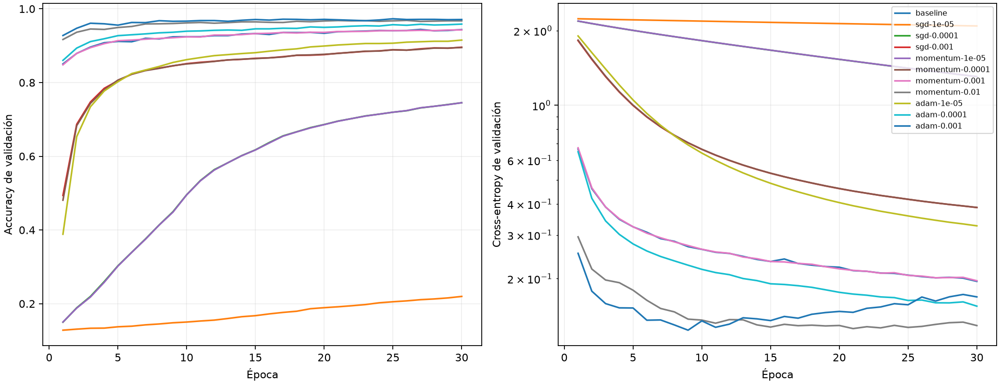
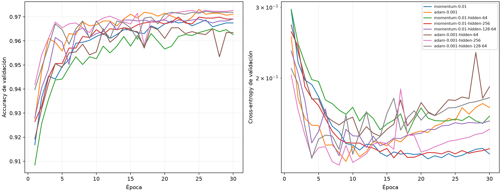
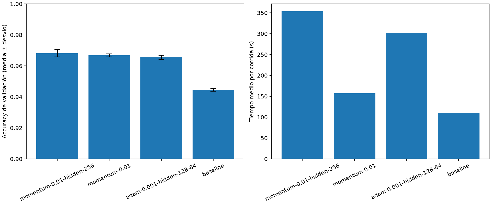
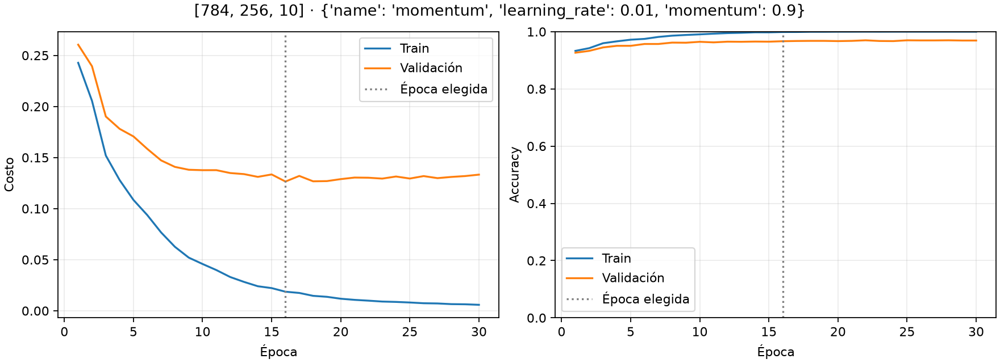
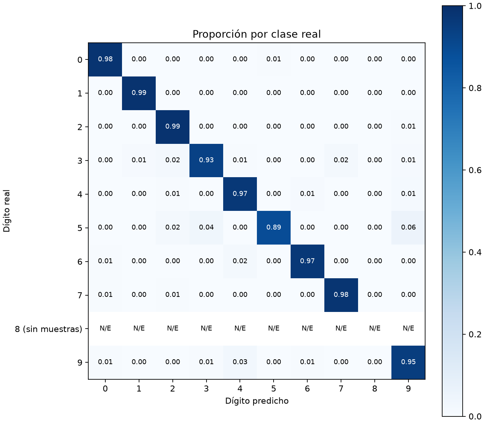

# Comparaciones de desarrollo — Ejercicio 2

Resultados de la partición fija de `digits.csv`; test reservado.

## Tasas y optimizadores

| Candidato | Accuracy | Cross-entropy | Época | Parámetros | Segundos |
|---|---:|---:|---:|---:|---:|
| baseline | 0.943753 | 0.194979 | 30 | 101770 | 68.0 |
| sgd-1e-05 | 0.219767 | 2.089532 | 30 | 101770 | 69.2 |
| sgd-0.0001 | 0.745279 | 1.304925 | 30 | 101770 | 71.1 |
| sgd-0.001 | 0.895942 | 0.387093 | 30 | 101770 | 66.8 |
| momentum-1e-05 | 0.745279 | 1.305510 | 30 | 101770 | 216.0 |
| momentum-0.0001 | 0.895139 | 0.387358 | 30 | 101770 | 233.3 |
| momentum-0.001 | 0.942949 | 0.196126 | 30 | 101770 | 151.1 |
| momentum-0.01 | 0.968260 | 0.125765 | 21 | 101770 | 95.9 |
| adam-1e-05 | 0.915227 | 0.326589 | 30 | 101770 | 456.7 |
| adam-0.0001 | 0.958618 | 0.154893 | 30 | 101770 | 454.5 |
| adam-0.001 | 0.966252 | 0.123923 | 9 | 101770 | 436.7 |

## Arquitecturas

| Candidato | Accuracy | Cross-entropy | Época | Parámetros | Segundos |
|---|---:|---:|---:|---:|---:|
| momentum-0.01 | 0.968260 | 0.125765 | 21 | 101770 | 95.9 |
| adam-0.001 | 0.966252 | 0.123923 | 9 | 101770 | 436.7 |
| momentum-0.01-hidden-64 | 0.963037 | 0.145189 | 18 | 50890 | 90.6 |
| momentum-0.01-hidden-256 | 0.966653 | 0.126520 | 16 | 203530 | 376.8 |
| momentum-0.01-hidden-128-64 | 0.965448 | 0.128060 | 8 | 109386 | 192.6 |
| adam-0.001-hidden-64 | 0.965448 | 0.143173 | 14 | 50890 | 139.1 |
| adam-0.001-hidden-256 | 0.965448 | 0.121343 | 8 | 203530 | 445.4 |
| adam-0.001-hidden-128-64 | 0.967055 | 0.126103 | 4 | 109386 | 279.8 |

## Confirmación con tres semillas

| Candidato | Accuracy media ± desvío | CE media ± desvío | Macro-F1 | Balanced accuracy | Épocas elegidas |
|---|---:|---:|---:|---:|---|
| momentum-0.01-hidden-256 | 0.968126 ± 0.002373 | 0.121875 ± 0.006796 | 0.962384 | 0.961248 | [16, 17, 22] |
| momentum-0.01 | 0.966787 ± 0.001055 | 0.125851 ± 0.000405 | 0.959473 | 0.958873 | [21, 20, 17] |
| adam-0.001-hidden-128-64 | 0.965448 ± 0.001312 | 0.128755 ± 0.002946 | 0.958796 | 0.955412 | [4, 5, 7] |
| baseline | 0.944556 ± 0.000868 | 0.192136 ± 0.002329 | 0.934680 | 0.934108 | [30, 30, 30] |

## Candidato con semilla predefinida 42

| Dígito | Soporte | Precision | Recall | F1 |
|---|---:|---:|---:|---:|
| 0 | 296 | 0.966777 | 0.983108 | 0.974874 |
| 1 | 337 | 0.985207 | 0.988131 | 0.986667 |
| 2 | 298 | 0.963934 | 0.986577 | 0.975124 |
| 3 | 306 | 0.976027 | 0.931373 | 0.953177 |
| 4 | 292 | 0.936877 | 0.965753 | 0.951096 |
| 5 | 54 | 0.923077 | 0.888889 | 0.905660 |
| 6 | 296 | 0.976109 | 0.966216 | 0.971138 |
| 7 | 313 | 0.977636 | 0.977636 | 0.977636 |
| 8 | 0 | N/E | N/E | N/E |
| 9 | 297 | 0.955782 | 0.946128 | 0.950931 |

