# Búsqueda v2 — un factor a la vez (desarrollo, ejercicio 2)

Partición fija de `digits.csv` (semilla 42, validación 20 %); `digits_test.csv` reservado.
Generado sólo desde artefactos guardados. Accuracy del mejor checkpoint (mínima
cross-entropy de validación). Con varias semillas: media ± desvío muestral (ddof=1).

## Etapa 0 — Activación

| Candidato | config_id | Semillas | Accuracy | Cross-entropy | Mejor época | Épocas | Parada | Parámetros | s/corrida |
|---|---|---|---:|---:|---|---|---|---:|---:|
| tanh-sgd-0.01 | `ab5b7a7b81bc5eec` | [42] | 0.9538 | 0.1636 | [100] | [100] | no convergió (presupuesto agotado) | 101770 | 41.6 |
| tanh-sgd-0.1 | `f807d94b0ff65abb` | [42] | 0.9663 | 0.1351 | [31] | [41] | parada temprana | 101770 | 16.9 |
| relu-sgd-0.01 | `18fa27645a769a1d` | [42] | 0.9590 | 0.1460 | [99] | [100] | no convergió (presupuesto agotado) | 101770 | 39.0 |
| relu-sgd-0.1 | `186e8bebf0849d92` | [42] | 0.9667 | 0.1238 | [21] | [31] | parada temprana | 101770 | 12.4 |

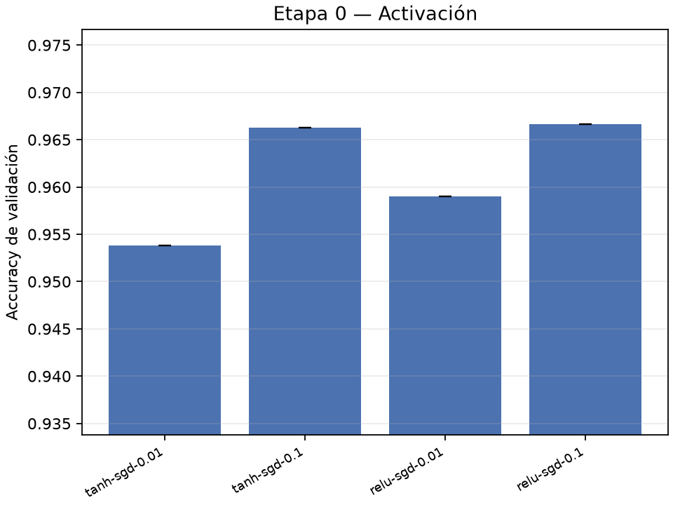

Decisión: tanh-sgd-0.1 — difference below threshold; tanh preferred (diferencia 0.04 pp).

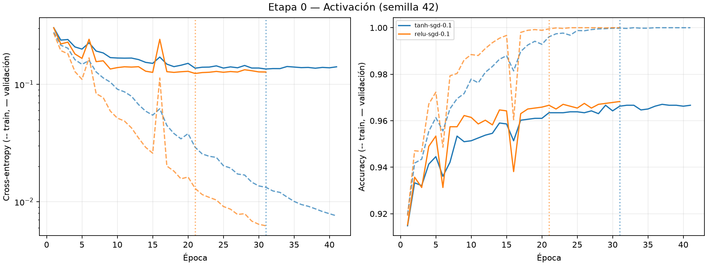

## Etapa 1 — Tasa por optimizador

| Candidato | config_id | Semillas | Accuracy | Cross-entropy | Mejor época | Épocas | Parada | Parámetros | s/corrida |
|---|---|---|---:|---:|---|---|---|---:|---:|
| sgd-0.001 | `6d73060956886433` | [42] | 0.9217 | 0.2717 | [100] | [100] | no convergió (presupuesto agotado) | 101770 | 47.8 |
| sgd-0.01 | `ab5b7a7b81bc5eec` | [42] | 0.9538 | 0.1636 | [100] | [100] | no convergió (presupuesto agotado) | 101770 | 41.6 |
| sgd-0.05 | `3705f5bec99846d3` | [42] | 0.9654 | 0.1385 | [60] | [70] | parada temprana | 101770 | 32.5 |
| sgd-0.1 | `f807d94b0ff65abb` | [42] | 0.9663 | 0.1351 | [31] | [41] | parada temprana | 101770 | 16.9 |
| sgd-0.3 | `8db0a95e590930ee` | [42] | 0.9695 | 0.1337 | [14] | [24] | parada temprana | 101770 | 9.0 |
| sgd-1 | `91ef2cd59cbbf00a` | [42] | 0.9626 | 0.2640 | [23] | [33] | parada temprana | 101770 | 12.3 |
| momentum-0.0001 | `395d1156807dd956` | [42] | 0.9217 | 0.2717 | [100] | [100] | no convergió (presupuesto agotado) | 101770 | 65.4 |
| momentum-0.001 | `afbc15597730ad8d` | [42] | 0.9538 | 0.1634 | [100] | [100] | no convergió (presupuesto agotado) | 101770 | 62.1 |
| momentum-0.01 | `3469c0a6b72950f6` | [42] | 0.9671 | 0.1361 | [31] | [41] | parada temprana | 101770 | 22.7 |
| momentum-0.05 | `84ff927c1c1803f5` | [42] | 0.9683 | 0.1305 | [9] | [19] | parada temprana | 101770 | 10.9 |
| momentum-0.1 | `9df75e8e35726026` | [42] | 0.9747 | 0.1520 | [11] | [21] | parada temprana | 101770 | 10.2 |
| momentum-0.3 | `40288fc13a6ef291` | [42] | 0.9068 | 0.9857 | [21] | [31] | parada temprana | 101770 | 15.6 |
| rmsprop-0.0001 | `adf6fa30784da424` | [42] | 0.9626 | 0.1434 | [95] | [100] | no convergió (presupuesto agotado) | 101770 | 71.7 |
| rmsprop-0.0003 | `593c7dde017df86e` | [42] | 0.9650 | 0.1404 | [37] | [47] | parada temprana | 101770 | 33.9 |
| rmsprop-0.001 | `72fe20eae96857f2` | [42] | 0.9695 | 0.1362 | [15] | [25] | parada temprana | 101770 | 18.3 |
| rmsprop-0.003 | `4ba75fd6c2eb32b7` | [42] | 0.9622 | 0.1397 | [5] | [15] | parada temprana | 101770 | 11.2 |
| adam-0.0001 | `6ca1ea281fda5f88` | [42] | 0.9606 | 0.1505 | [69] | [79] | parada temprana | 101770 | 68.8 |
| adam-0.0003 | `5d17d0d6109254da` | [42] | 0.9626 | 0.1465 | [25] | [35] | parada temprana | 101770 | 33.0 |
| adam-0.001 | `d1d19881987ed5bd` | [42] | 0.9675 | 0.1398 | [14] | [24] | parada temprana | 101770 | 22.7 |
| adam-0.003 | `b0d0d20e8efcf5cf` | [42] | 0.9667 | 0.1374 | [7] | [17] | parada temprana | 101770 | 14.2 |

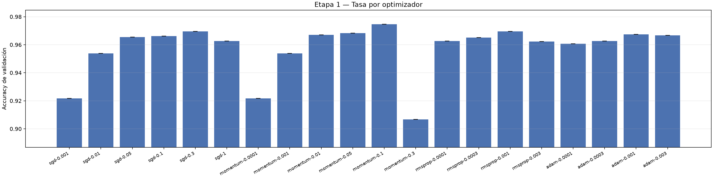

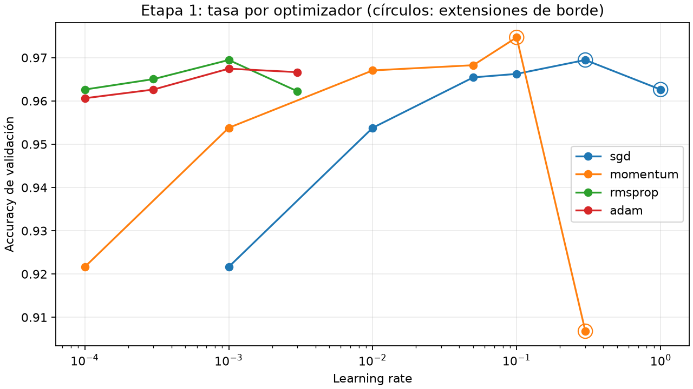

| Optimizador | Grilla probada | Mejor tasa |
|---|---|---:|
| sgd | [0.001, 0.01, 0.05, 0.1, 0.3, 1.0] | 0.3 |
| momentum | [0.0001, 0.001, 0.01, 0.05, 0.1, 0.3] | 0.1 |
| rmsprop | [0.0001, 0.0003, 0.001, 0.003] | 0.001 |
| adam | [0.0001, 0.0003, 0.001, 0.003] | 0.001 |

Extensiones de borde:

- Ronda 1: sgd, mejor 0.1 en el borde superior → se agrega 0.3.
- Ronda 1: momentum, mejor 0.05 en el borde superior → se agrega 0.1.
- Ronda 2: sgd, mejor 0.3 en el borde superior → se agrega 1.
- Ronda 2: momentum, mejor 0.1 en el borde superior → se agrega 0.3.

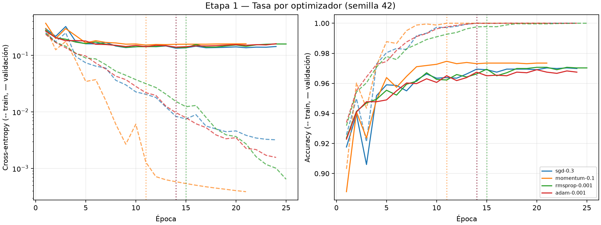

## Etapa 2 — Optimizador

| Candidato | config_id | Semillas | Accuracy | Cross-entropy | Mejor época | Épocas | Parada | Parámetros | s/corrida |
|---|---|---|---:|---:|---|---|---|---:|---:|
| sgd-0.3 | `8db0a95e590930ee` | [42] | 0.9695 | 0.1337 | [14] | [24] | parada temprana | 101770 | 9.0 |
| momentum-0.1 | `9df75e8e35726026` | [42] | 0.9747 | 0.1520 | [11] | [21] | parada temprana | 101770 | 10.2 |
| rmsprop-0.001 | `72fe20eae96857f2` | [42] | 0.9695 | 0.1362 | [15] | [25] | parada temprana | 101770 | 18.3 |
| adam-0.001 | `d1d19881987ed5bd` | [42] | 0.9675 | 0.1398 | [14] | [24] | parada temprana | 101770 | 22.7 |

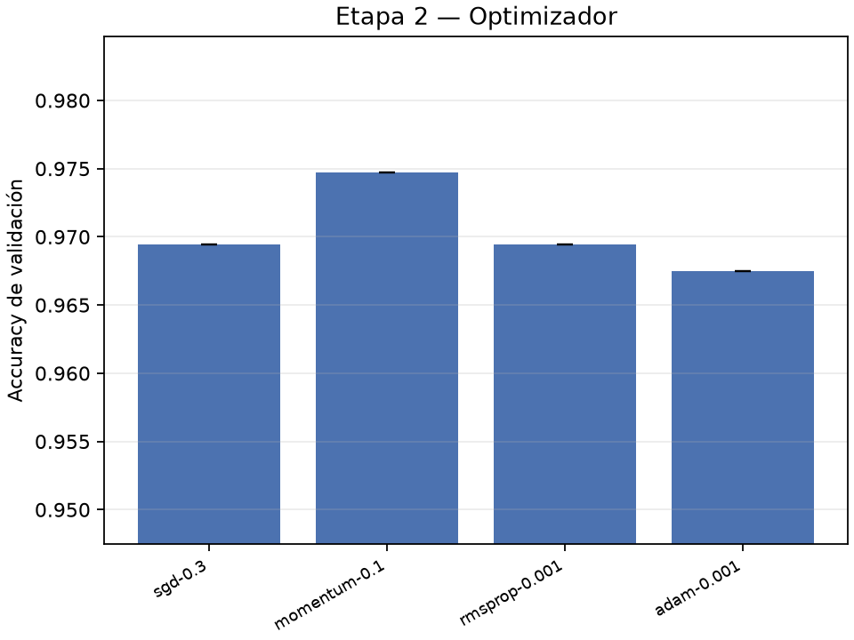

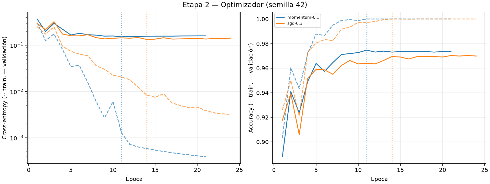

## Etapa 3 — Ancho

| Candidato | config_id | Semillas | Accuracy | Cross-entropy | Mejor época | Épocas | Parada | Parámetros | s/corrida |
|---|---|---|---:|---:|---|---|---|---:|---:|
| width-32 | `8847fa4355e586df` | [42] | 0.9498 | 0.1965 | [8] | [18] | parada temprana | 25450 | 3.8 |
| width-64 | `43494c07592f1fe6` | [42] | 0.9691 | 0.1580 | [10] | [20] | parada temprana | 50890 | 6.3 |
| width-128 | `9df75e8e35726026` | [42] | 0.9747 | 0.1520 | [11] | [21] | parada temprana | 101770 | 10.2 |
| width-256 | `a2fa557ace07f890` | [42] | 0.9707 | 0.1971 | [28] | [38] | parada temprana | 203530 | 66.6 |
| width-512 | `1eb6b62b255444b1` | [42] | 0.9667 | 0.2770 | [16] | [26] | parada temprana | 407050 | 84.5 |

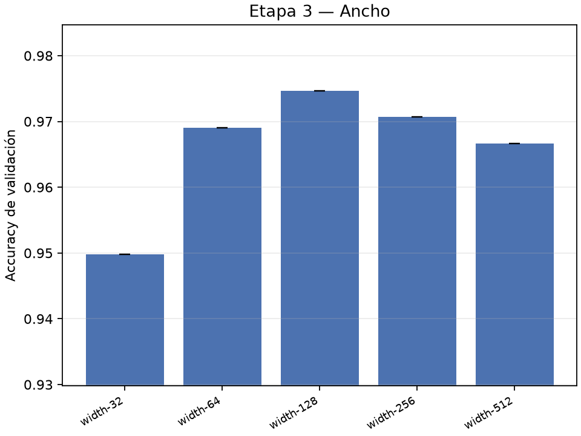

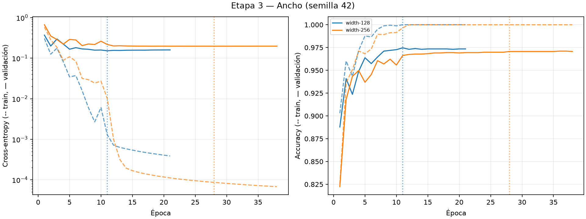

## Etapa 4 — Profundidad

| Candidato | config_id | Semillas | Accuracy | Cross-entropy | Mejor época | Épocas | Parada | Parámetros | s/corrida |
|---|---|---|---:|---:|---|---|---|---:|---:|
| hidden-128 | `9df75e8e35726026` | [42] | 0.9747 | 0.1520 | [11] | [21] | parada temprana | 101770 | 10.2 |
| hidden-128-64 | `8850cf7ac6c3ccc9` | [42] | 0.9671 | 0.1649 | [15] | [25] | parada temprana | 109386 | 13.6 |
| hidden-128-64-32 | `6714dddac64b999e` | [42] | 0.9474 | 0.1984 | [8] | [18] | parada temprana | 111146 | 10.6 |

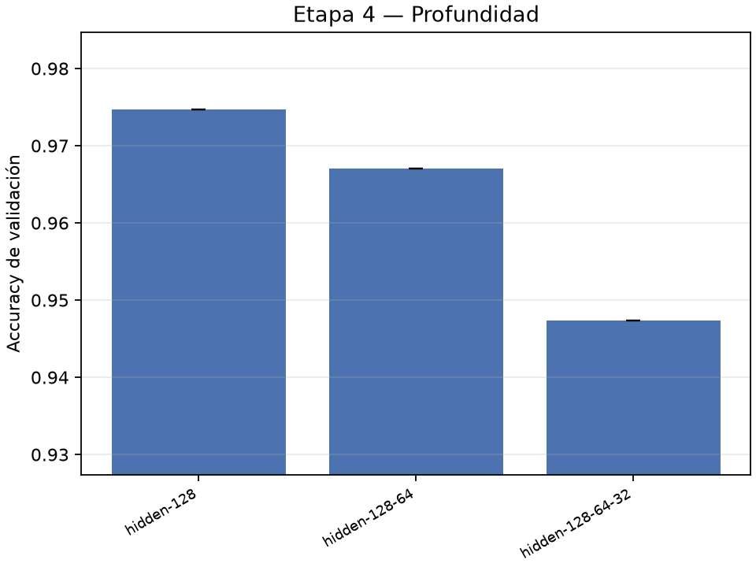

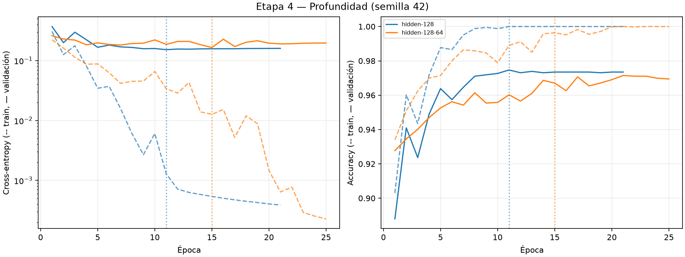

## Etapa 5 — Tamaño de lote

| Candidato | config_id | Semillas | Accuracy | Cross-entropy | Mejor época | Épocas | Parada | Parámetros | s/corrida |
|---|---|---|---:|---:|---|---|---|---:|---:|
| batch-16 | `206d70f977fbdd80` | [42] | 0.8955 | 0.5864 | [2] | [12] | parada temprana | 101770 | 9.0 |
| batch-32 | `9df75e8e35726026` | [42] | 0.9747 | 0.1520 | [11] | [21] | parada temprana | 101770 | 10.2 |
| batch-64 | `858ffd4f0978229c` | [42] | 0.9687 | 0.1323 | [11] | [21] | parada temprana | 101770 | 8.8 |
| batch-128 | `de8cce9317251be0` | [42] | 0.9650 | 0.1328 | [11] | [21] | parada temprana | 101770 | 7.8 |

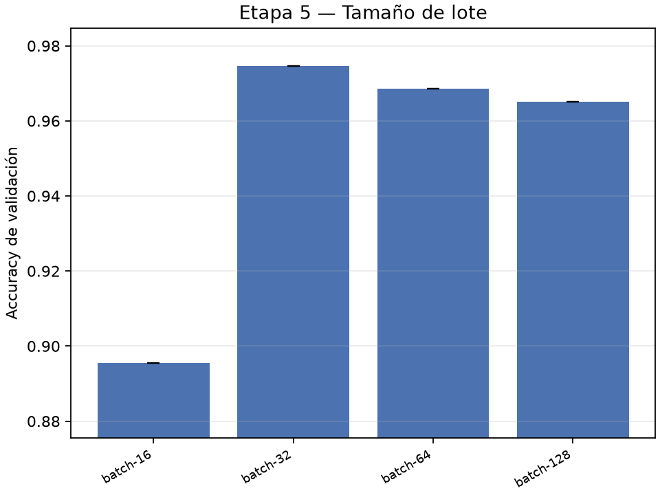

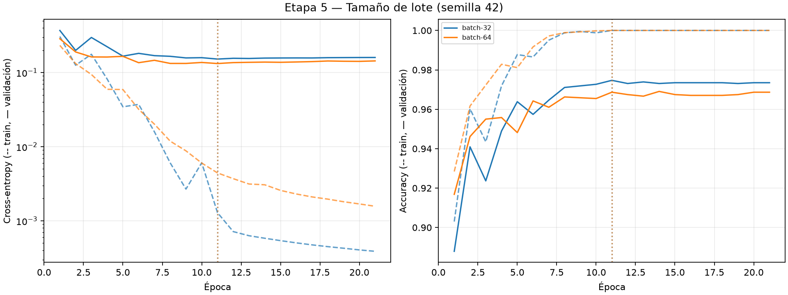

## Etapa 6 — Cruce chico (3 semillas)

| Candidato | config_id | Semillas | Accuracy | Cross-entropy | Mejor época | Épocas | Parada | Parámetros | s/corrida |
|---|---|---|---:|---:|---|---|---|---:|---:|
| momentum-0.1-hidden-128 | `9df75e8e35726026` | [0, 1, 42] | 0.9717 ± 0.0028 | 0.1625 | [11, 13, 11] | [21, 23, 21] | parada temprana | 101770 | 12.8 |
| momentum-0.1-hidden-256 | `a2fa557ace07f890` | [0, 1, 42] | 0.9719 ± 0.0014 | 0.1897 | [12, 16, 28] | [22, 26, 38] | parada temprana | 203530 | 55.8 |
| momentum-0.05-hidden-128 | `84ff927c1c1803f5` | [0, 1, 42] | 0.9687 ± 0.0004 | 0.1341 | [9, 6, 9] | [19, 16, 19] | parada temprana | 101770 | 10.9 |
| momentum-0.05-hidden-256 | `53ff0b2ae5f90723` | [0, 1, 42] | 0.9697 ± 0.0020 | 0.1428 | [13, 11, 14] | [23, 21, 24] | parada temprana | 203530 | 47.3 |
| sgd-0.3-hidden-128 | `8db0a95e590930ee` | [0, 1, 42] | 0.9695 ± 0.0008 | 0.1360 | [14, 13, 14] | [24, 23, 24] | parada temprana | 101770 | 10.0 |
| sgd-0.3-hidden-256 | `d2d44bc446408f43` | [0, 1, 42] | 0.9641 ± 0.0016 | 0.1435 | [13, 10, 9] | [23, 20, 19] | parada temprana | 203530 | 30.3 |
| sgd-0.1-hidden-128 | `f807d94b0ff65abb` | [0, 1, 42] | 0.9657 ± 0.0025 | 0.1360 | [28, 22, 31] | [38, 32, 41] | parada temprana | 101770 | 15.9 |
| sgd-0.1-hidden-256 | `4fb64836a9065a0f` | [0, 1, 42] | 0.9632 ± 0.0012 | 0.1417 | [24, 28, 28] | [34, 38, 38] | parada temprana | 203530 | 50.1 |

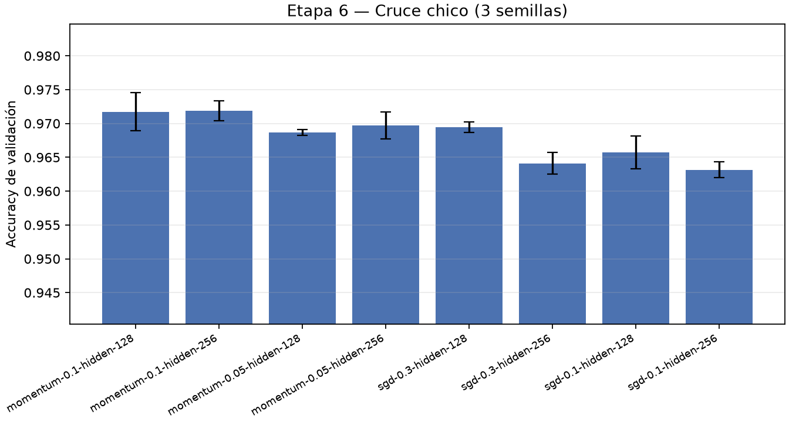

- primero vs. segundo: ventaja 0.01 pp; 2σ = 0.45 pp (σ agrupado 0.22 pp) → no supera la regla de mejora.

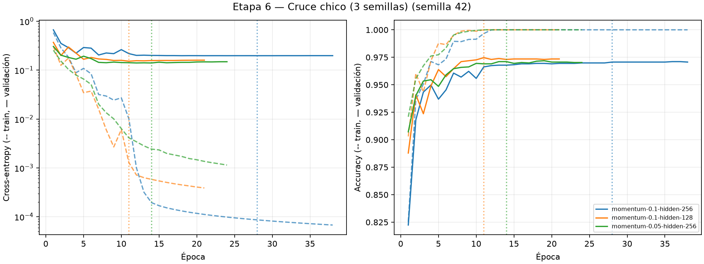

## Etapa 7 — Confirmación (5 semillas)

| Candidato | config_id | Semillas | Accuracy | Cross-entropy | Mejor época | Épocas | Parada | Parámetros | s/corrida |
|---|---|---|---:|---:|---|---|---|---:|---:|
| momentum-0.1-hidden-256 | `a2fa557ace07f890` | [0, 1, 2, 3, 42] | 0.9724 ± 0.0015 | 0.1897 | [12, 16, 13, 14, 28] | [22, 26, 23, 24, 38] | parada temprana | 203530 | 53.8 |
| momentum-0.1-hidden-128 | `9df75e8e35726026` | [0, 1, 2, 3, 42] | 0.9708 ± 0.0024 | 0.1592 | [11, 13, 11, 10, 11] | [21, 23, 21, 20, 21] | parada temprana | 101770 | 12.6 |
| momentum-0.05-hidden-256 | `53ff0b2ae5f90723` | [0, 1, 2, 3, 42] | 0.9688 ± 0.0019 | 0.1419 | [13, 11, 9, 10, 14] | [23, 21, 19, 20, 24] | parada temprana | 203530 | 45.6 |
| control-tanh-sgd-0.1 | `f807d94b0ff65abb` | [0, 1, 2, 3, 42] | 0.9644 ± 0.0037 | 0.1384 | [28, 22, 19, 30, 31] | [38, 32, 29, 40, 41] | parada temprana | 101770 | 14.9 |

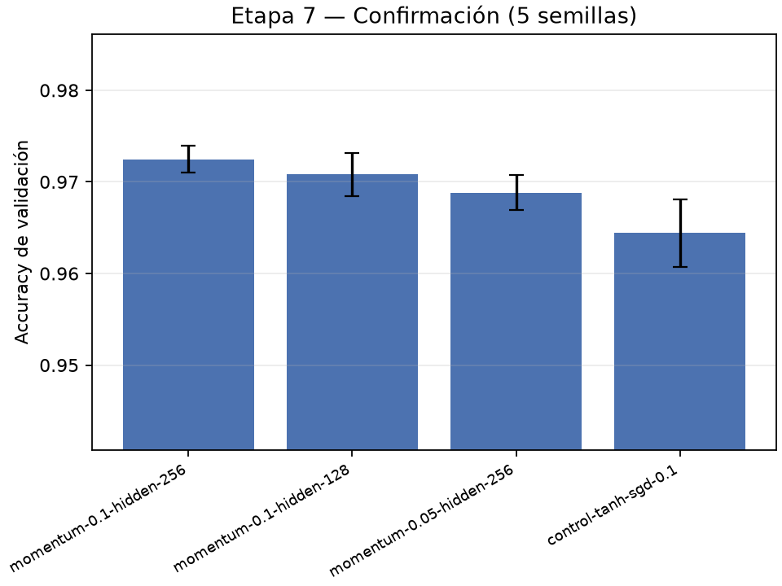

- winner_vs_runner_up: ventaja 0.16 pp; 2σ = 0.39 pp (σ agrupado 0.20 pp) → no supera la regla de mejora.
- winner_vs_control: ventaja 0.80 pp; 2σ = 0.56 pp (σ agrupado 0.28 pp) → supera la regla de mejora.

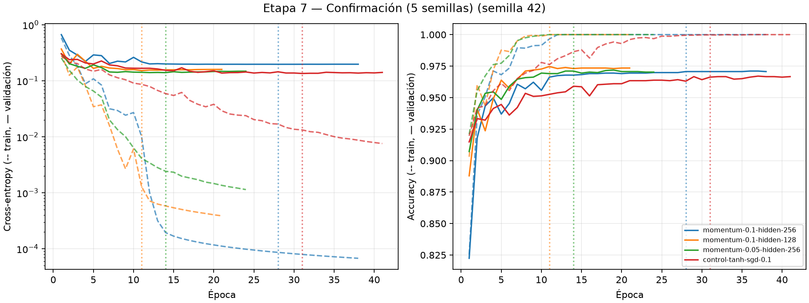

## Ganador final (semilla 42, mejor checkpoint)

`a2fa557ace07f890`: época 28; reentrenamiento eventual de 14 épocas.

| Dígito | Soporte | Precision | Recall | F1 |
|---|---:|---:|---:|---:|
| 0 | 296 | 0.9864 | 0.9831 | 0.9848 |
| 1 | 337 | 0.9852 | 0.9881 | 0.9867 |
| 2 | 298 | 0.9575 | 0.9832 | 0.9702 |
| 3 | 306 | 0.9795 | 0.9346 | 0.9565 |
| 4 | 292 | 0.9625 | 0.9658 | 0.9641 |
| **5** | 54 | 0.8596 | 0.9074 | 0.8829 |
| 6 | 296 | 0.9765 | 0.9831 | 0.9798 |
| 7 | 313 | 0.9715 | 0.9808 | 0.9762 |
| **8** | 0 | — | N/E (sin muestras) | — |
| 9 | 297 | 0.9660 | 0.9562 | 0.9611 |

El 8 no tiene muestras en la validación de `digits.csv`: su recall no es evaluable.

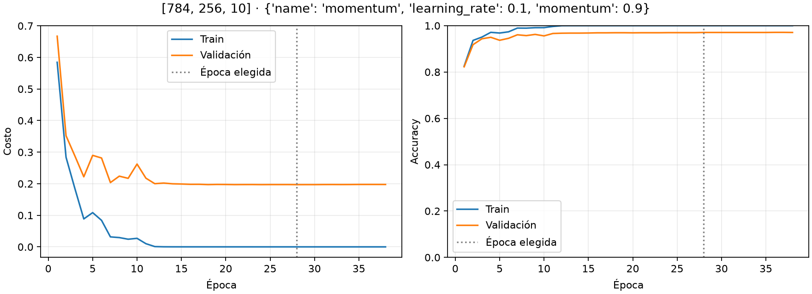

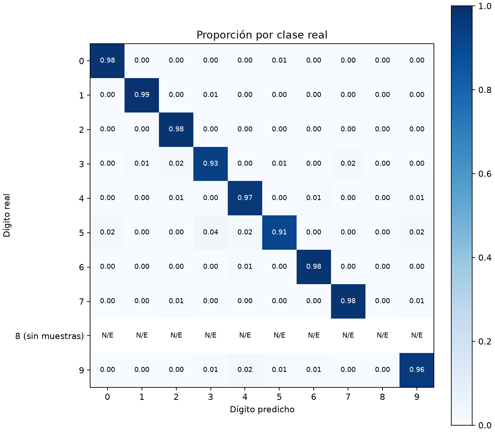
