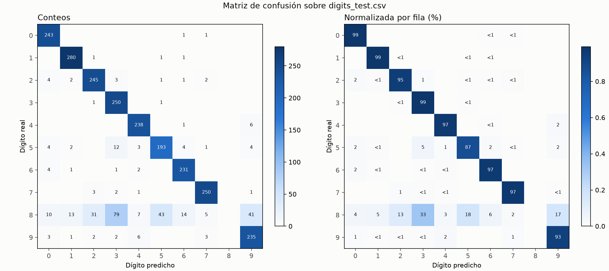
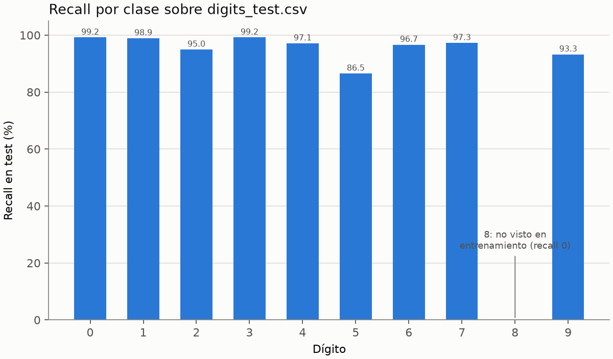

# Evaluación final — ejercicio 2

Modelo: `runs/a2fa557ace07f890-seed-42/best_model.npz` (configuración `a2fa557ace07f890`, semilla 42, época 28; SHA-256 `51d2208f10e44358…` verificado contra `selection.json`). Sin reentrenar.
Test: `data/digits_test.csv`, 2497 muestras (SHA-256 `56e2ca2d55a7a646…`). Evaluado una sola vez; el test no se usó para ninguna selección ni umbral.

## Accuracy

| Conjunto | Muestras | Accuracy (%) | Cross-entropy |
|---|---:|---:|---:|
| Test, todas las clases | 2497 | **86.70** | 1.7493 |
| Test, sin el 8 (clases vistas en entrenamiento) | 2254 | **96.05** | 0.2263 |
| Validación, mismo modelo (semilla 42) | 2489 | 97.07 | 0.1971 |
| Validación, misma configuración, media de 5 semillas | 2489 | 97.24 ± 0.15 | — |

`digits.csv` no contiene ningún 8: el modelo nunca vio esa clase y, salvo por azar, no puede predecirla. Cada 8 del test es entonces un error estructural, que la accuracy global incluye. La accuracy sin el 8 mide el desempeño sobre las clases que el modelo pudo aprender y es la comparable con validación, que tampoco tiene ningún 8. Las dos se informan juntas: la global es el resultado real sobre el test; la otra separa el efecto de la clase ausente.

## El dígito 8

- Muestras con etiqueta 8 en test: 243.
- Predicciones iguales a 8: 0 (esperado: 0).
- Los 8 del test se asignaron a: 3 (79), 5 (43), 9 (41), 2 (31), 6 (14), 1 (13), 0 (10), 4 (7), 7 (5).

## Métricas por clase

| Dígito | Muestras | Predicciones | Precision (%) | Recall (%) | F1 (%) |
|---|---:|---:|---:|---:|---:|
| 0 | 245 | 268 | 90.67 | 99.18 | 94.74 |
| 1 | 283 | 299 | 93.65 | 98.94 | 96.22 |
| 2 | 258 | 283 | 86.57 | 94.96 | 90.57 |
| 3 | 252 | 349 | 71.63 | 99.21 | 83.19 |
| 4 | 245 | 257 | 92.61 | 97.14 | 94.82 |
| 5 | 223 | 239 | 80.75 | 86.55 | 83.55 |
| 6 | 239 | 253 | 91.30 | 96.65 | 93.90 |
| 7 | 257 | 262 | 95.42 | 97.28 | 96.34 |
| 8 | 243 | 0 | indefinida | 0.00 | 0.00 |
| 9 | 252 | 287 | 81.88 | 93.25 | 87.20 |

Para el 8: recall 0 porque ninguna de sus muestras se clasificó como 8; precision indefinida porque no hubo predicciones de 8 (0/0). Macro-F1 82.05 % y balanced accuracy 86.32 %, promediadas sobre las clases presentes en test.

## Matriz de confusión

Filas: dígito real; columnas: dígito predicho (conteos).

| Real \ Pred. | 0 | 1 | 2 | 3 | 4 | 5 | 6 | 7 | 8 | 9 |
|---|---:|---:|---:|---:|---:|---:|---:|---:|---:|---:|
| **0** | 243 | 0 | 0 | 0 | 0 | 0 | 1 | 1 | 0 | 0 |
| **1** | 0 | 280 | 1 | 0 | 0 | 1 | 1 | 0 | 0 | 0 |
| **2** | 4 | 2 | 245 | 3 | 0 | 1 | 1 | 2 | 0 | 0 |
| **3** | 0 | 0 | 1 | 250 | 0 | 1 | 0 | 0 | 0 | 0 |
| **4** | 0 | 0 | 0 | 0 | 238 | 0 | 1 | 0 | 0 | 6 |
| **5** | 4 | 2 | 0 | 12 | 3 | 193 | 4 | 1 | 0 | 4 |
| **6** | 4 | 1 | 0 | 1 | 2 | 0 | 231 | 0 | 0 | 0 |
| **7** | 0 | 0 | 3 | 2 | 1 | 0 | 0 | 250 | 0 | 1 |
| **8** | 10 | 13 | 31 | 79 | 7 | 43 | 14 | 5 | 0 | 41 |
| **9** | 3 | 1 | 2 | 2 | 6 | 0 | 0 | 3 | 0 | 235 |

Normalizada por fila (% de cada dígito real):

| Real \ Pred. | 0 | 1 | 2 | 3 | 4 | 5 | 6 | 7 | 8 | 9 |
|---|---:|---:|---:|---:|---:|---:|---:|---:|---:|---:|
| **0** | 99.2 | 0 | 0 | 0 | 0 | 0 | 0.4 | 0.4 | 0 | 0 |
| **1** | 0 | 98.9 | 0.4 | 0 | 0 | 0.4 | 0.4 | 0 | 0 | 0 |
| **2** | 1.6 | 0.8 | 95.0 | 1.2 | 0 | 0.4 | 0.4 | 0.8 | 0 | 0 |
| **3** | 0 | 0 | 0.4 | 99.2 | 0 | 0.4 | 0 | 0 | 0 | 0 |
| **4** | 0 | 0 | 0 | 0 | 97.1 | 0 | 0.4 | 0 | 0 | 2.4 |
| **5** | 1.8 | 0.9 | 0 | 5.4 | 1.3 | 86.5 | 1.8 | 0.4 | 0 | 1.8 |
| **6** | 1.7 | 0.4 | 0 | 0.4 | 0.8 | 0 | 96.7 | 0 | 0 | 0 |
| **7** | 0 | 0 | 1.2 | 0.8 | 0.4 | 0 | 0 | 97.3 | 0 | 0.4 |
| **8** | 4.1 | 5.3 | 12.8 | 32.5 | 2.9 | 17.7 | 5.8 | 2.1 | 0 | 16.9 |
| **9** | 1.2 | 0.4 | 0.8 | 0.8 | 2.4 | 0 | 0 | 1.2 | 0 | 93.3 |

