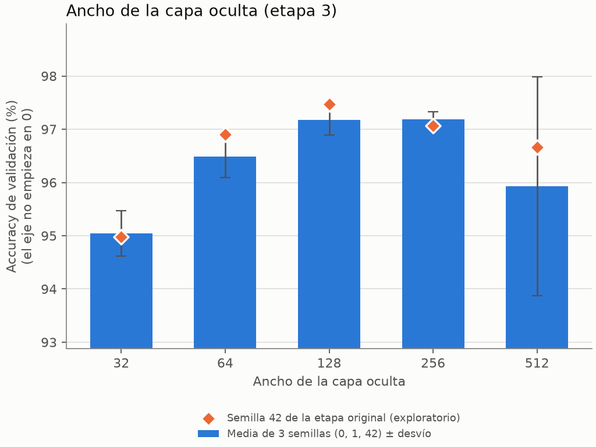
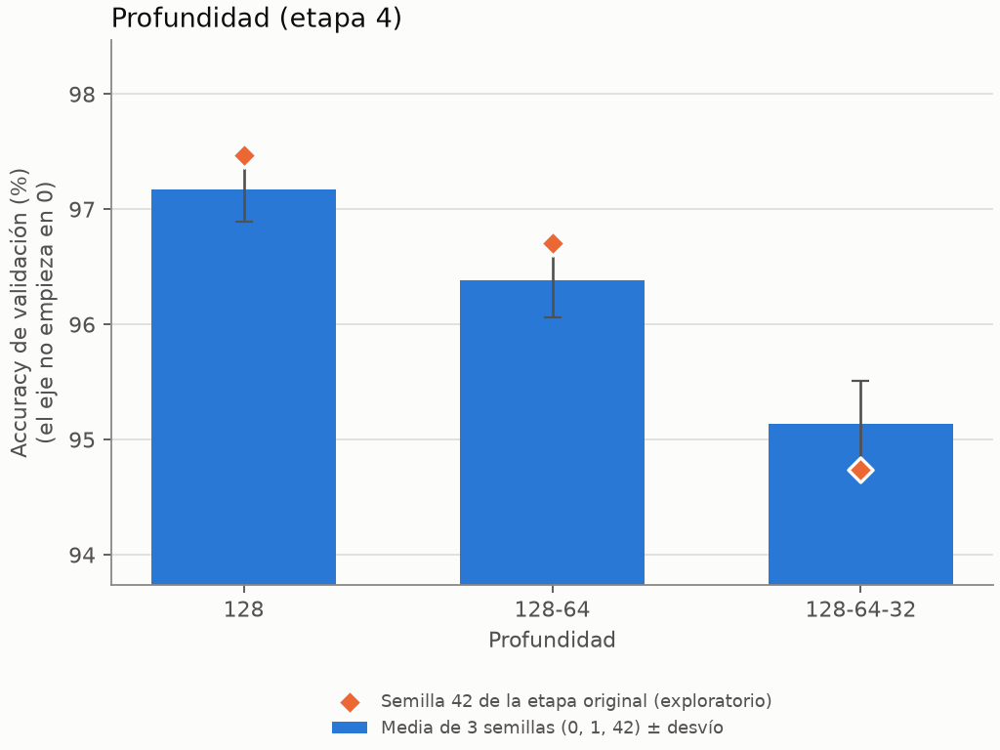
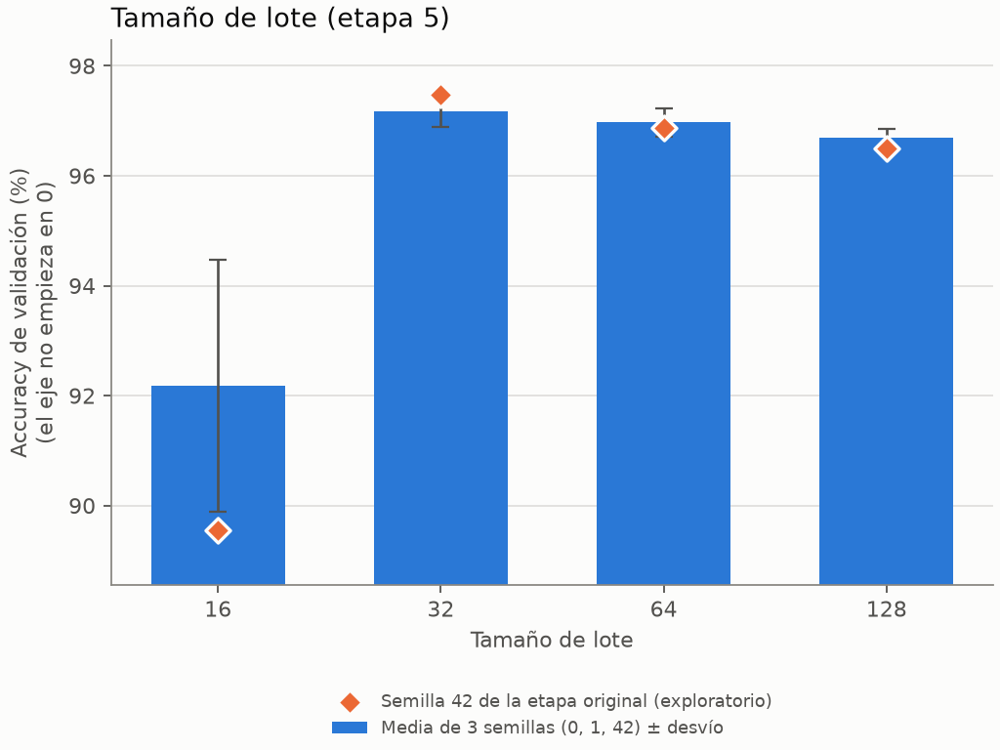

# Apéndice de la búsqueda v2 del ejercicio 2

Generado desde `relu/summary.json` y `stages_3_5/summary.json`. Selección vigente: `a2fa557ace07f890` (no se modifica). El conjunto de test no se usa.

## A. ReLU en la configuración final

Comprobación posterior, **no selección**: no puede cambiar el ganador ni `selection.json`. Misma configuración que la seleccionada (`[784,256,10]`, momentum 0,1, lote 32, parada temprana, partición 42), cambiando sólo la activación; inicialización automática del código actual (He en las capas ocultas con ReLU; Xavier en la salida y con tanh).

Semillas: 42, 0, 1, 2, 3. Corridas reutilizadas de v2: 5; entrenadas: 5; tiempo: 59 s.

| Activación | Accuracy val. (%) | Desvío (pp) | CE val. | Desvío CE | Mejores épocas (semillas 0, 1, 2, 3, 42) | Tiempo medio (s) |
|---|---:|---:|---:|---:|---|---:|
| tanh (seleccionada) | 97.24 | 0.15 | 0.1897 | 0.0139 | 12, 16, 13, 14, 28 | 53.8 |
| relu | 96.95 | 0.69 | 0.1383 | 0.0102 | 10, 11, 4, 5, 10 | 37.8 |

Diferencia de medias a favor de tanh: 0.29 pp; σ agrupado 0.50 pp; umbral 2σ = 1.00 pp. No supera el umbral de la regla de la etapa 7.

## B. Etapas 3, 4 y 5 con tres semillas

Misma base que el incumbente de esas etapas (tanh, momentum 0,1, `[784,128,10]`, lote 32), variando un factor a la vez como en `search_v2.json`. Los valores de **semilla 42** son los de la etapa original: una sola semilla, por lo tanto **exploratorios**. La columna Δ es la media de 3 semillas menos ese valor.

Corridas reutilizadas de v2: 20; entrenadas: 16; tiempo: 159 s.

### Ancho de la capa oculta (etapa 3)

| Valor | Accuracy 3 semillas (%) | Desvío (pp) | CE media | Semilla 42 original (%) | Δ (pp) | Mejores épocas (semillas 0, 1, 42) |
|---|---:|---:|---:|---:|---:|---|
| 32 | 95.04 | 0.43 | 0.1901 | 94.98 | +0.07 | 2, 11, 8 |
| 64 | 96.49 | 0.40 | 0.1575 | 96.91 | -0.42 | 3, 8, 10 |
| 128 (incumbente) | 97.17 | 0.28 | 0.1625 | 97.47 | -0.29 | 11, 13, 11 |
| 256 | 97.19 | 0.14 | 0.1897 | 97.07 | +0.12 | 12, 16, 28 |
| 512 | 95.93 | 2.05 | 0.2949 | 96.67 | -0.74 | 25, 2, 16 |

Mejor con 3 semillas: 256; mejor con semilla 42 (etapa original): 128. **No coinciden.**
Contra el incumbente: +0.01 pp, umbral 2σ = 0.45 pp; no supera el umbral.

### Profundidad (etapa 4)

| Valor | Accuracy 3 semillas (%) | Desvío (pp) | CE media | Semilla 42 original (%) | Δ (pp) | Mejores épocas (semillas 0, 1, 42) |
|---|---:|---:|---:|---:|---:|---|
| 128 (incumbente) | 97.17 | 0.28 | 0.1625 | 97.47 | -0.29 | 11, 13, 11 |
| 128-64 | 96.38 | 0.32 | 0.1683 | 96.71 | -0.32 | 5, 11, 15 |
| 128-64-32 | 95.14 | 0.37 | 0.1902 | 94.74 | +0.40 | 11, 6, 8 |

Mejor con 3 semillas: 128; mejor con semilla 42 (etapa original): 128. Coinciden.

### Tamaño de lote (etapa 5)

| Valor | Accuracy 3 semillas (%) | Desvío (pp) | CE media | Semilla 42 original (%) | Δ (pp) | Mejores épocas (semillas 0, 1, 42) |
|---|---:|---:|---:|---:|---:|---|
| 16 | 92.18 | 2.29 | 0.5474 | 89.55 | +2.62 | 13, 21, 2 |
| 32 (incumbente) | 97.17 | 0.28 | 0.1625 | 97.47 | -0.29 | 11, 13, 11 |
| 64 | 96.97 | 0.26 | 0.1327 | 96.87 | +0.11 | 11, 8, 11 |
| 128 | 96.69 | 0.17 | 0.1310 | 96.50 | +0.19 | 11, 14, 11 |

Mejor con 3 semillas: 32; mejor con semilla 42 (etapa original): 32. Coinciden.

Nota: con lote 16, tasa 0,1 y momentum 0,9 el entrenamiento es inestable (mejor época 2 en la etapa original). La comparación de lotes está confundida con la tasa, que el protocolo mantiene fija; no se ajustó nada.

